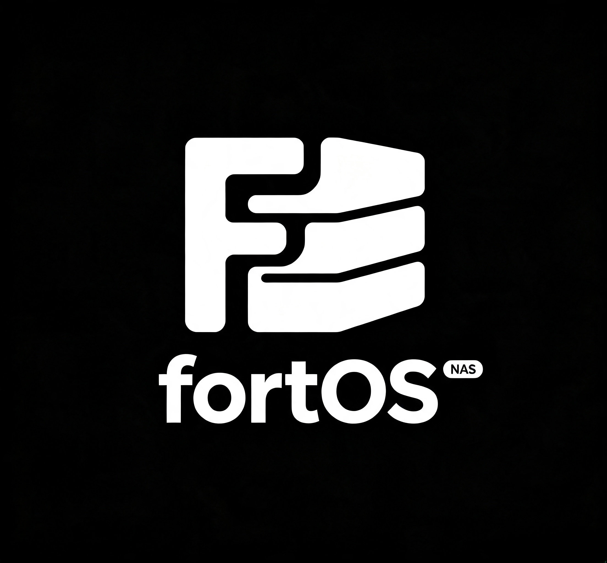

<p align="center">
  
</p>


<p align="center">
  <em>A modern, security-first <strong>Linux NAS operating system</strong>, built on <strong>.NET 10</strong>.</em>
</p>

<p align="center">
  
  
  
</p>

---

FortOS runs bare-metal via a **Debian 12 ISO** or inside **Docker** for evaluation. All management surfaces expose a unified **REST/gRPC API** and a **terminal CLI**; Docker containers are first-class citizens alongside native services (SMB, NFS, rsync, snapshots).

## ✨ Features

| Pillar | Capabilities |
| --- | --- |
| 🗄️ **Storage** | Disk discovery, RAID (mdadm), ext4/XFS/Btrfs/ZFS, SMART monitoring, per-share quotas |
| 🔗 **Sharing** | SMB, NFS, FTP, recycle bin with retention policies |
| 🛡️ **Protection** | Snapshots (btrfs/LVM thin), rsync backup, cloud backup, point-in-time restore |
| 🔐 **Security** | NasToken capability tokens, fine-grained NAbility permissions, data classification, HMAC-chained audit |
| 🐳 **Containers** | Agent Catalog, Token Broker, hardened Compose generation |
| 📈 **Observability** | Metrics (host/SMART/RAID/Docker), 5-stage log pipeline with Loki, alert engine, Prometheus `/metrics` |

## 🚀 Quick Start

**Option A — Docker (evaluation)**

```bash
git clone https://github.com/GeneralLibrary/fortOS.git
cd fortOS
docker compose up -d --build
```

**Option B — Bare metal**

Download the Debian 12 ISO built by the [FortOS ISO workflow](https://github.com/GeneralLibrary/fortOS/actions/workflows/iso.yml) and flash it onto your NAS hardware.

## 💻 CLI examples

```bash
fortos status --watch --interval 5                    # TUI dashboard & live metrics
fortos disk list --output json                        # disk inventory
fortos share create media --path /srv/nas/media --protocols smb,nfs
fortos agent deploy nginx-basic --image nginx:alpine  # container agent
fortos backup task set media-backup --source /srv/nas/media --cron interval:60
fortos audit verify --output json
```

## 🔌 Interfaces

| Interface | Endpoint |
| --- | --- |
| REST API | `http://localhost:5000/api/` |
| gRPC (HTTP/2) | port `5001` |
| Web dashboard | `/dashboard` |

## 📄 License

Open-source under the [LICENSE](LICENSE) file.
